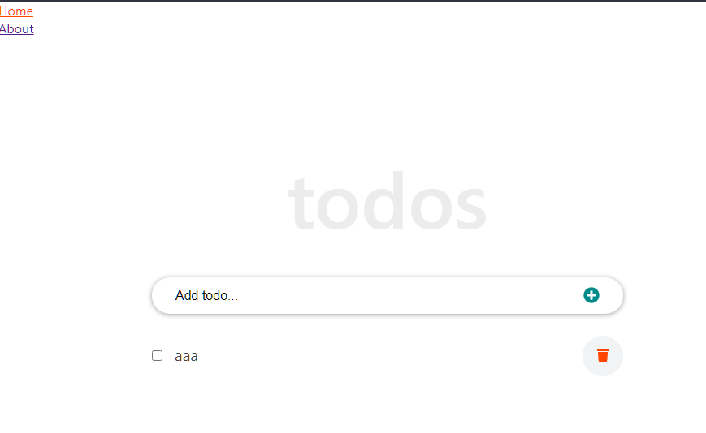

# Project Name

On this project I code along this [tutorial](https://ibaslogic.com/react-tutorial-for-beginners/) to get a better understanding of React, specially the router.

## Built With

- React
- CSS

## Live Demo

[Live Demo Link](https://leolpaz.github.io/react-todo-app/)

## Getting Started

To get a local copy up and running follow these simple example steps.

- Clone the repository with git clone https://github.com/leolpaz/Math-Magicians.git;
- Install dependencies with npm i;
- Use npm start to create the dev server;
- Go to http://localhost:3000/ on your browser if it doesn't do it automatically once you create the dev server

## Authors

👤 **Leonardo Paz**

- Github: [Leonardo Paz](https://github.com/leolpaz)
- Twitter: [Leonardo Paz](https://twitter.com/leonardolpaz95)
- Linkedin: [Leonardo Paz](https://www.linkedin.com/in/leonardo-paz-a925611b5/)

## 🤝 Contributing

Contributions, issues, and feature requests are welcome!

Feel free to check the [issues page](../../issues/).

## Show your support

Give a ⭐️ if you like this project!

## Acknowledgments

- Hat tip to anyone whose code was used
- Microverse
- React documentation

## 📝 License

This project is [MIT](./MIT.md) licensed.